# Jeeves Architecture Documentation

## Overview

Jeeves is a semantic memory system for Open-WebUI that captures conversation context, embeds it with `sentence-transformers`, and stores it in **Qdrant** vector database. The system consists of three microservices:

1. **Memory API** — Conversation memory storage and retrieval (port 8000)
2. **Extractor API** — Media-to-text extraction (images, audio, PDF, code) (port 8002)
3. **Pragmatics API** — Intent classification (save vs. other) (port 8002)
4. **Qdrant** — Vector database for semantic search (port 6333)

---

## System Architecture

```mermaid
flowchart TB
    subgraph User["Open-WebUI (User)"]
        UserInput["User sends message"]
        UserReads["User reads response"]
    end

    subgraph Filter["Filter.inlet() - memory.filter.py"]
        F1["1. Extract files/images"]
        F2["2. Save chunks to memory"]
        F3["3. Search for context"]
        F4["4. Inject into request"]
    end

    subgraph MemoryAPI["Memory API (FastAPI)"]
        direction TB
        Routes["Routes: /save, /search, /summaries"]
        M1["1. Receive chunks from filter"]
        M2["2. Classify importance"]
        M3["3. Embed with SentenceTransformer"]
        M4["4. Upsert to Qdrant"]
        M5["5. Search for existing context"]
        M6["6. Return context + status"]
    end

    subgraph Qdrant["Qdrant Vector Database"]
        QConfig["Collection: user_memory_collection<br/>Dimension: 768 (all-mpnet-base-v2)<br/>Similarity: COSINE<br/>Threshold: 0.35"]
    end

    subgraph Support["Support Services"]
        Pragmatics["Pragmatics Classifier<br/>Save vs Other Intent<br/>(0.70 threshold)"]
        Extractor["Extractor API<br/>• Image → LLaVA<br/>• Audio → Whisper<br/>• PDF → PyMuPDF<br/>• Code → Chunker"]
    end

    LLM["LLM Response"]

    UserInput --> Filter
    Filter --> MemoryAPI
    MemoryAPI -->|"Embedding"| Qdrant
    MemoryAPI -->|"Search/Upsert"| Qdrant
    MemoryAPI --> Pragmatics
    Filter --> Extractor
    Extractor -->|"Chunks"| MemoryAPI
    MemoryAPI -->|"Context injected"| LLM
    LLM --> UserReads
```



---

## Data Flow

### 1. User sends message with attachment


### 2. Memory save flow


### 3. Context injection


**Example context payload:**

```json
[
  {
    "user_text": "I need to set up CI/CD for our Python project",
    "summary": "User asked about CI/CD setup for Python...",
    "source_type": "prompt",
    "source_name": "~30 words from user prompt"
  },
  {
    "user_text": "[Image]: The dashboard shows...",
    "source_type": "image",
    "source_name": "uploaded_image_0"
  }
]
```

---

## Component Details

### Memory API (`tools-api/memory/`)

**Files:**

- `main.py` — FastAPI app setup, middleware, health check
- `api/memory.py` — Router with `/save` and `/search` endpoints
- `services/embedder.py` — SentenceTransformer embedding
- `services/qdrant_client.py` — Lazy singleton Qdrant connection
- `services/summarizer.py` — Optional DistilBART summarization
- `services/fact_extractor.py` — KeyBERT importance filtering
- `memory.filter.py` — Open-WebUI filter plugin (669 lines, 8 sections)
- `utils/schemas.py` — Pydantic models for request/response

**Endpoints:**

```
POST /api/memory/save
  Input: SaveRequest (user_id, messages, model, metadata, source_type)
  Process:
    1. Check importance (KeyBERT)
    2. Embed with SentenceTransformer
    3. Search Qdrant for similar context
    4. Upsert to Qdrant
    5. Optionally summarize
  Output: {status, existing_context, summary}

POST /api/memory/search
  Input: SearchRequest (user_id, query_text, top_k)
  Process:
    1. Embed query with SentenceTransformer
    2. Search Qdrant with score_threshold
    3. Filter by user_id
  Output: {results: [{user_text, summary, score, source}]}

POST /api/memory/summaries
  Input: SearchRequest
  Output: {summaries: [{summary, score}]}

GET /health
  Output: {status, memory_api: ok, qdrant: ok}

GET /api/memory/filter
  Output: Source code of memory.filter.py (for Open-WebUI parsing)
```

**Configuration (Environment):**

```
QDRANT_HOST=qdrant                    # Qdrant service hostname
QDRANT_PORT=6333                      # Qdrant HTTP port
INDEX_NAME=user_memory_collection     # Collection name
EMBEDDING_PROVIDER=sentence_transformers
SUMMARY_MODEL=sshleifer/distilbart-cnn-12-6
SUMMARY_DEVICE=cpu                    # cpu or 0,1,2,... for GPU
HF_HOME=/models                       # HuggingFace cache directory
STORE_VERBATIM=true|false             # Store full text alongside summaries
```

---

### Extractor API (`tools-api/extractor/`)

**Purpose:** Extract text from media (images, audio, PDF, code)

**Files:**

- `main.py` — FastAPI app, startup model preloading
- `api/extractor.py` — `/extract` endpoint, content-type routing
- `services/image_extractor.py` — LLaVA or Florence image description
- `services/audio_extractor.py` — Whisper transcription
- `services/pdf_extractor.py` — PyMuPDF text extraction
- `services/chunker.py` — Text segmentation by function/class/heading

**Models:**

```
Image Extraction:
  • LLaVA-1.5-7B (4-bit, ~4GB VRAM) — Default, lazy-loaded at startup
  • Florence-2 (fallback if LLaVA unavailable)
  • Query: "Describe this image in detail: [image]"

Audio Transcription:
  • Whisper (base model)
  • Auto-detects language, returns full transcript

PDF Extraction:
  • PyMuPDF (fitz)
  • OCR for scanned documents (if available)

Code Chunking:
  • Language-aware segmentation (Python, JavaScript, etc.)
  • Chunks by function/class/import statements
  • Preserves context (parent class, module)
```

**Endpoint:**

```
POST /api/extract
  Input: {
    content: "base64 or text",
    content_type: "image/png|application/pdf|audio/mp3|text/plain",
    source_name: "filename",
    chunk_size: 500,
    chunk_overlap: 50,
    prompt: "optional guided prompt for images"
  }
  Output: {
    chunks: [{
      content: "extracted text",
      chunk_index: 0,
      chunk_type: "text|heading|function",
      section_title: "optional"
    }]
  }
```

**Configuration:**

```
IMAGE_MODEL=llava-4bit|llava|florence
HF_HOME=/models
DEVICE=cuda|cpu
```

---

### Pragmatics API (`tools-api/pragmatics/`)

**Purpose:** Binary intent classification (save vs. other)

**Model:** DistilBERT fine-tuned for "save memory" intent

- Training data: ~1300 examples (save/recall/other)
- Threshold: 0.70 (conservative: prefers NOT saving when uncertain)
- Latency: ~5ms per sample

**Endpoint:**

```
POST /classify
  Input: {user_id, messages, user_prompt}
  Output: {
    intent: "save",
    confidence: 0.92,
    keywords: ["ci/cd", "setup", "python"]
  }
```

---

### Qdrant Vector Database

**Configuration:**

```
Container: qdrant/qdrant:latest
Ports:
  - 6333 (HTTP API)
  - 5100 (Web Dashboard UI)

Collection: user_memory_collection
  Vector Size: 768 (all-mpnet-base-v2)
  Distance: COSINE
  Storage: /qdrant/storage (mounted to C:/docker-data/qdrant/storage)

Search Parameters:
  - score_threshold: 0.35 (lowered from 0.45 for better recall)
  - top_k: 5 (per search)
  - filter: {key: 'user_id', match: {value: req.user_id}}
```

---

## Docker Architecture

### Multi-stage Build Strategy

Each service uses a **base image** on Docker Hub + thin app layer:


**Build Performance:**

| Scenario                       | Time    | Notes                              |
| ------------------------------ | ------- | ---------------------------------- |
| First build (with base images) | ~30 sec | Pulls base from Docker Hub         |
| Code change only               | ~2 sec  | App layer rebuild only             |
| Base image rebuild             | 35+ min | Only when requirements.txt changes |

### Docker Compose

**Memory API** (`tools-api/memory/docker-compose.yaml`):

```yaml
services:
  memory_api:
    build:
      context: ..
      dockerfile: memory/Dockerfile
    environment: QDRANT_HOST=qdrant
      QDRANT_PORT=6333
      INDEX_NAME=user_memory_collection
    ports: [8000:8000]
    volumes: [C:/docker-data/models:/models]
    networks: [webtools_network]
```

**Network:** External network `webtools_network` (shared with Ollama, Open-WebUI)

---

## Integration with Open-WebUI

### Filter Plugin Contract

Open-WebUI calls filter at two points:

**1. inlet (before LLM sees the message)**

```python
async def inlet(body: dict, __event_emitter__, __user__: dict):
    # Extract files/images
    # Search memory
    # Inject context into body["messages"]
    # Emit status events for UI
    return modified_body
```

**2. outlet (after LLM response)**

```python
async def outlet(body: dict, __event_emitter__, __user__: dict):
    # Currently no-op
    # Could save assistant responses or update context
    pass
```

### Status Events

Filter emits UI updates as the process runs:

```
✨ Processing...          (initial)
📄 Saving 5 chunks...     (during extraction)
🧠 Found 3 memories       (after search)
  • "Set up CI/CD..."
  • 🖼 uploaded_image_0
  • [Highlighted previous context]
✔ Context injected        (done)
```

---

## Performance Metrics

### Latency (per conversation turn)

| Operation      | Time  | Notes                                    |
| -------------- | ----- | ---------------------------------------- |
| Extract images | 2-5s  | ~1s per image (LLaVA inference)          |
| Extract PDF    | 1-3s  | Depends on pages                         |
| Embed message  | 50ms  | SentenceTransformer                      |
| Search Qdrant  | 100ms | Cosine similarity, top-5                 |
| Filter total   | <10s  | (includes extraction, search, injection) |

### Storage

| Aspect                    | Size   | Notes              |
| ------------------------- | ------ | ------------------ |
| Model: all-mpnet-base-v2  | ~430MB | Embeddings         |
| Model: distilbart-cnn     | ~250MB | Summarization      |
| Model: LLaVA-1.5-7B       | ~4GB   | 4-bit quantized    |
| Qdrant: per 1000 memories | ~50MB  | Vectors + metadata |

---

## Deployment Notes

### Prerequisites

- Docker with GPU support (for LLaVA, optional for memory)
- NVIDIA CUDA 12.1+ (if using GPU for image extraction)
- 16GB+ RAM (8GB minimum, 16GB recommended)
- 10GB+ disk space (for models)

### Environment Variables

**Memory API:**

```bash
export QDRANT_HOST=qdrant
export QDRANT_PORT=6333
export SUMMARY_DEVICE=cpu  # or 0 for GPU:0
export STORE_VERBATIM=true
```

**Extractor API:**

```bash
export IMAGE_MODEL=llava-4bit  # or llava, florence
export DEVICE=cuda  # or cpu
export HF_HOME=/models
```

### Startup Sequence

1. Qdrant starts, initializes storage
2. Memory API starts, connects to Qdrant, loads embedding model
3. Extractor API starts, **preloads LLaVA at startup** (eliminates 8-12s first-request latency)
4. Open-WebUI detects filter via `GET /.well-known/ai-plugin.json`
5. First user message triggers extraction/memory flow

---

## Key Decisions & Trade-offs

| Decision                               | Rationale                                  | Trade-off                                               |
| -------------------------------------- | ------------------------------------------ | ------------------------------------------------------- |
| Cosine similarity (0.35 threshold)     | Better semantic matching, higher recall    | Some false positives (mitigated by relevance filtering) |
| SentenceTransformer 768-dim            | Fast embedding, good quality               | Requires VRAM, ~430MB model                             |
| LLaVA 4-bit quantization               | Fits in ~4GB VRAM                          | Slight quality loss (~5% accuracy)                      |
| Qdrant over Pinecone/Weaviate          | Self-hosted, no API costs, flexible        | Requires management, backups                            |
| DistilBERT for intent (0.70 threshold) | Conservative: avoid saving trivial queries | Misses some important context (acceptable trade-off)    |
| Lazy model loading (except extractor)  | Reduces startup time                       | First image request slower (now preloaded)              |

---

## Future Enhancements

1. **Adaptive Threshold:** Dynamically adjust Qdrant threshold based on collection size and user feedback
2. **Model Selection:** Allow users to choose embedding model (e.g., bge-large-en for better performance)
3. **Multi-user Isolation:** Enhanced privacy controls per workspace
4. **Context Summarization:** Compress old memories to reduce latency for large datasets
5. **Duplicate Detection:** Avoid storing near-duplicate memories
6. **Feedback Loop:** User ratings of injected context to improve ranking

---

## Quick Reference

### Endpoints

| Service    | Method | Route                   | Purpose         |
| ---------- | ------ | ----------------------- | --------------- |
| Memory     | POST   | `/api/memory/save`      | Save + search   |
| Memory     | POST   | `/api/memory/search`    | Search only     |
| Memory     | POST   | `/api/memory/summaries` | Get summaries   |
| Memory     | GET    | `/health`               | Health check    |
| Extractor  | POST   | `/api/extract`          | Extract text    |
| Pragmatics | POST   | `/classify`             | Classify intent |

### Key Files

```
c:\Code\jeeves\
├── tools-api/
│   ├── memory/
│   │   ├── main.py              ← FastAPI app
│   │   ├── api/memory.py        ← /save, /search routes
│   │   ├── memory.filter.py     ← Open-WebUI filter (669 lines, 8 sections)
│   │   ├── services/
│   │   │   ├── embedder.py      ← SentenceTransformer
│   │   │   ├── qdrant_client.py ← Qdrant singleton
│   │   │   └── summarizer.py    ← DistilBART
│   │   └── Dockerfile           ← 3-layer caching
│   ├── extractor/
│   │   ├── main.py              ← Startup model preloading
│   │   ├── api/extractor.py     ← /extract endpoint
│   │   ├── services/
│   │   │   ├── image_extractor.py  ← LLaVA/Florence
│   │   │   └── audio_extractor.py  ← Whisper
│   │   └── Dockerfile
│   └── pragmatics/
│       ├── server.py            ← /classify endpoint
│       ├── services/
│       │   └── classifier.py    ← DistilBERT
│       └── Dockerfile
└── ARCHITECTURE.md              ← This file
```

---

## Related Documentation

- `.github/copilot-instructions.md` — Detailed operational guidelines
- `README.md` — Setup and usage instructions
- Individual service Dockerfiles — Build details and dependencies
